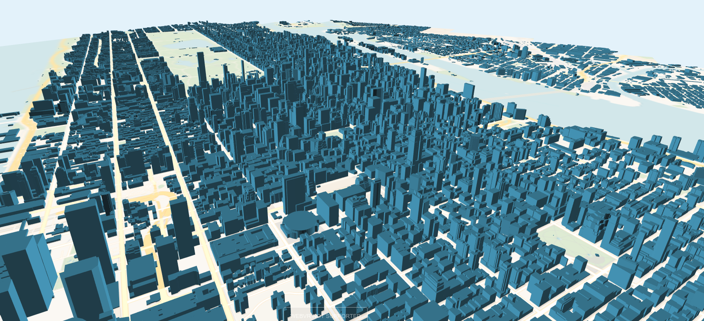

# Visualisation of geodata with Three.js

This website is a project of the class of Interaktive Geomediengestaltung at the 
Beuth university in Winter 2018.

### Roadmap:

* VR support with controller 
* buttons rotate ... done!
* buttons pitch ...done!
* rising building effect ... done!
* enable origin change ... map gets set by URL
* shadows
* evaluate properties of datasources like colors, min building heights
* new datasources (mapbox)
* sky(move sphere around camera https://github.com/mrdoob/three.js/blob/master/examples/webgl_materials_lightmap.html) ... done!
* animations (skeleton, chicken, birds,...?)
* elevation
* lower framerate on map idle
* tile loading
    * view polygon instead of radius around camera for tile loading
    * only add new tile data(building data) when not paning or moving camera
    * bigger radius(polygon) for maptiles than for buildings
    * different array for different tiles?
    * loading basemaptiles on paning but not building tiles

## Model Objects 

**how to:**

* texture from picture(http://opengameart.org)
* shader optimization
* three.js color, different types maybe
* random colors for buildings with no attributes

### Buildings:

* color (pass building color to shader) ...done!
* roofs?
* OSMB list from material from Jan
    * glass
    * concrete
    * metal
    * brick
    * plaster
* OSM (order of apperance on taginfo) building:material https://wiki.openstreetmap.org/wiki/Key:building:material
    * cement_block
    * brick
    * plaster
    * wood
    * concrete
    * metal
    * stone
    * steel
    * glass

### Landuse:

* water (special water layer in Mapbox)
* grass texture?
* forest (single trees on it)
* parks together with grass?
* single trees as models

### transportation:

* streets
* railways

### Basemap:

how to do model:

* raster map tiles as texture for plane mesh
* optimized for different zoom level

### presentation:

* Explain topic: What is this about
* What is WebGL, three.js and a-frame
* show steps of development on PC
* what happens internally when switching to vr mode
* show map with HMD:
    * on Oculus Go and PC connected HTC Vive
    * explain what the difference is 
* show many building map
* problems like: 
    * finding init position(two different coordination systems)
    * mesh amount
    * data amount on tile loading
    * textures on worker
* solutions:
    * web worker
    * map tiling