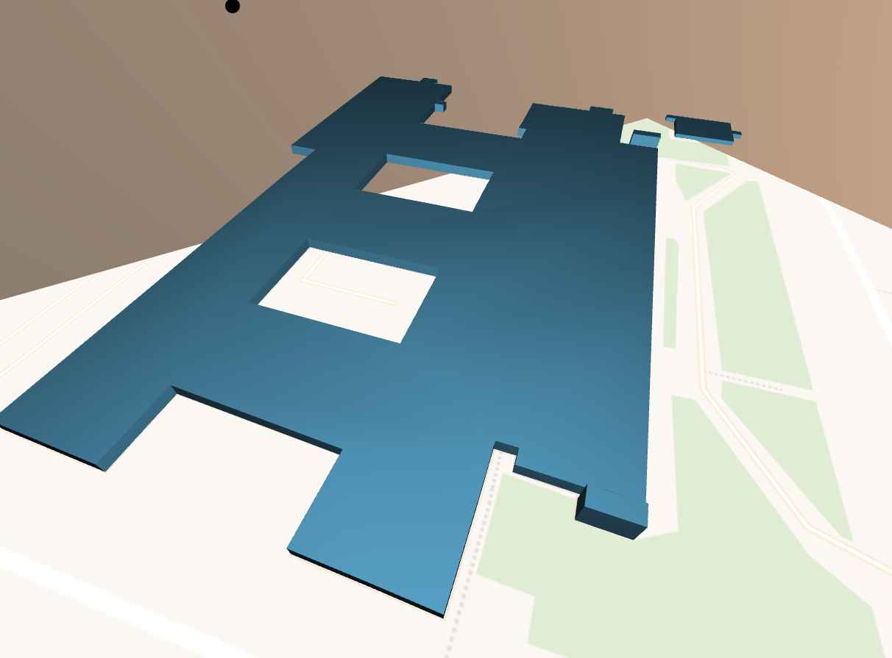

# Visualisation of geodata with Three.js

This website is a project of the class of Interaktive Geomediengestaltung at the 
Beuth university in Winter 2018.

###Roadmap:

* VR support with controller 
* buttons rotate
* buttons pitch
* shadows
* evaluate properties of datasources like colors, min building heights
* new datasources (mapbox)
* sky(move sphere around camera https://github.com/mrdoob/three.js/blob/master/examples/webgl_materials_lightmap.html)
* animations (skeleton, chicken, birds,...?)
* elevation

## Model Objects 

**how to:**

* texture from picture(http://opengameart.org)
* shader optimization
* three.js color, different types maybe
* random colors for buildings with no attributes

### Buildings:

* color (pass building color to shader)
* roofs?
* stone
* glass
* metal
* wood

### Landuse:

* water (special water layer in Mapbox)
* grass texture?
* forest (single trees on it)
* parks together with grass?
* single trees as models

### transportation:

* streets
* railways

### Basemap:

how to do model:

* raster map tiles as texture for plane mesh
* optimized for different zoom level
